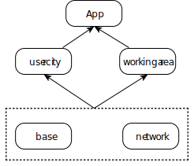

# Glovo Android Challenge
This app solves the Glovo Android Challenge.
### Getting Started
- Setup and run the [server](https://github.com/Glovo/glovo-challengemobile) 
- Checkout this project and edit the server url address in the following line of the [app module's build.gradle file](app/build.gradle): 
 ``` buildConfigField "String", "SERVER_BASE_URL", "\"http://10.0.2.2:3000/\""```
- Run the app

### Project Structure
This project was organized using the principles of the [app modularization by features](https://proandroiddev.com/intro-to-app-modularization-42411e4c421e). Although this approach is not necessary for an app as small as this challenge, it is useful to demonstrate how to structure a project that aims to build a robust and scalable application. This is a very common and good practice to keep different teams working on isolated and decoupled features. This application was divided in two "product features": 
- **User City**: This feature is the responsible for getting the code of the city where the user is located, using two strategies: the current user device location, and the available city picker screen which is displayed to the user when the application starts and cannot be able to fetch the device location.
- **Working Area**: The main screen of the app, which loads the map of available zones and the details of the city focused on the map.

In addition to these modules, the project contains the following additional ones:
- **app**: This is the main application module which contains the application class and the navigation logic. The *NavigationActivity* is the responsible for manage the user through the flow composed by all the product features, loading the different features activities.
- **base**: This is a base module which contains architecture base classes and helpers, which are used by the different product modules. 
- **networkdatasource**: This module contains the logic to manage the network communication between the different product modules and the server, bringing a common data source class, which is instantiated by the network repositories of the different product modules.



### Architecture
In order to maintain this code decoupled, testable and robust, the architecture of this app was designed using [clean architecture](http://blog.cleancoder.com/uncle-bob/2012/08/13/the-clean-architecture.html). Each Product Feature contains the following layers represented as packages in the src module folder:
- **Domain Layer**: Contains the business logic of each module, totally independent of the device, the networking data or the ui. Each business logic task is represented as an *Use Case*.
- **Data Layer**: Represented by *Repositories* which have the responsibility to access and get data from the different sources (Device, Cache and Networking).
- **Presentation Layer**: Layer responsible for displaying the information provided by the business logic layer, using the UI interface. This layer use the [Google's architecture components](https://developer.android.com/topic/libraries/architecture/) approach to manipulate data between the activities/fragment and the presentation classes (represented by ViewModels).

The communication and transformation of data between different layers was represented by *Mapper* classes. Each user flow which implements these three layers was developed using **async, event-based and reactive programming** with [RxJava](https://github.com/ReactiveX/RxJava).


### Dependency Injection
All the app component dependencies are injected using [Koin](https://insert-koin.io/), which provides a lightweight and pure Kotlin dependency injection mechanism with [glorious support for Android architecture classes such as ViewModels](https://insert-koin.io/docs/1.0/documentation/reference/index.html#_architecture_components_with_koin_viewmodel). Each module has an extra package called *module* who contains the injections of all the dependencies used by this module.

### Unit Testing
Each module contains a set of unit test classes that intends to test every component of the architecture. These test classes were designed to check the output of the class being tested, using [Mockito](https://site.mockito.org/) as a mocking mechanism of their inputs and dependencies.

### Polygons Representation
As specified in the challenge statement, this app represents the available zones of the Glovo service using polygons displayed in the main Google Map screen. In order to avoid overlapped polygons when each city is represented, and also to avoid overlapped polygons between cities (such as Rio de Janeiro Center and North Rio de Janeiro), a [polygon combination algorithm](workingarea/src/main/java/gaston/gsanguinetti/glovo/workingarea/presentation/mapper/MapPresentationContentMapper.kt) was developed using the [JTS library](http://metteo.github.io/jts/web/index.html). A unit test class with a valid example of this combination can [be found here](workingarea/src/test/java/gaston/gsanguinetti/glovo/workingarea/presentation/mapper/MapPresentationContentMapperTest.kt).